# Générer une notification par mail avec Azure Functions

## 1) Quelques mots sur Azure Functions
Azure Functions est une technologie dite "event-driven" et "serverless".
Les fonctions Azure permet d'exécuter du code dans le cloud uniquement lorsque cela est nécessaire.
Nous serons donc facturés seulement à l’utilisation, c’est-à-dire lorsqu’il y aura un traitement effectif.
Dans ce mini-hack, il s'agit de mettre en place un service capable d'envoyer un mail de notification lorsque qu'une nouvelle branche est créée au sein d'un projet Platform.sh.
Pour ce faire, nous allons utiliser conjointement Azure Functions et SendGrid.
La création de fonctions Azure est possible depuis [un portail dédié à Azure Functions] (https://functions.azure.com/signin) ou depuis [le portail Azure] (https://portal.azure.com).
Dans ce mini hack, nous utiliserons le portail Azure. 

## 2) Créer un compte SendGrid et une clé d'API

Sendgrid est un service qui permet d’envoyer des emails via des API. 
Des SDK pour de nombreux langages comme C#, Ruby, NodeJS et PHP facilitent l'utilisation des API de SendGrid.
Sengrid est disponible depuis le Marketplace Azure et permet l'envoi de 25000 emails gratuits chaque mois.
Nous allons maintenant créer un compte SendGrid et une clé d'API pour pouvoir envoyer des emails depuis notre fonction Azure :
- Connectez-vous au portail Azure
- Cliquez sur __Nouveau__
- Dans la zone de recherche __Rechercher dans le marketplace__, saisissez __SendGrid__
- Tapez sur le touche __Entrée__ de votre clavier pour lancer la recherche

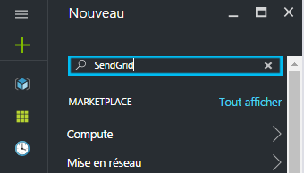

*Le Marketplace Azure trouve "SendGrid Email Delivery" dans les résultats de la recherche.*

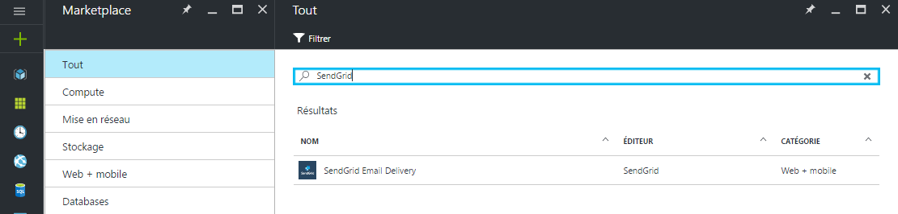

- Cliquez sur __SendGrid Email Delivery__ dans les résultats de la recherche
- Dans la section __SendGrid Email Delivery__, cliquez sur __Créer__

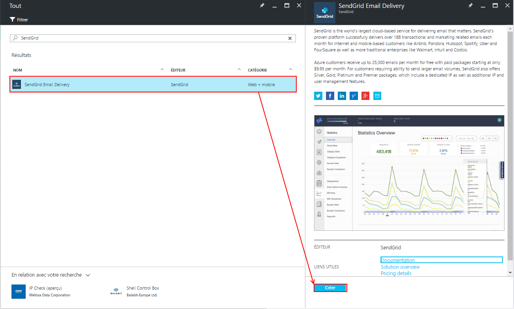

- Renseignez les informations nécessaires pour la création du compte SendGrid :
    - Dans la zone de saisie __Name__, saisissez un nom de compte
    - Dans la zone de saisie __Password, saisissez un mot de passe
    - Dans la zone de saisie __Confirm Password, confirmez le mot de passe
    - Dans la zone de sélection __Abonnement__, sélectionnez l'abonnement Azure (dans le cas où vous possédez plusieurs comptes Azure)
    - Dans la zone __Groupe de ressources__, créez un nouveau groupe de ressources ou sélectionnez un groupe de ressources existant
    - Cliquez sur __Princing tiers__ puis sélectionnez l'offre __F1 Free__ et cliquez sur __Sélectionner__ pour valider le pricing
    
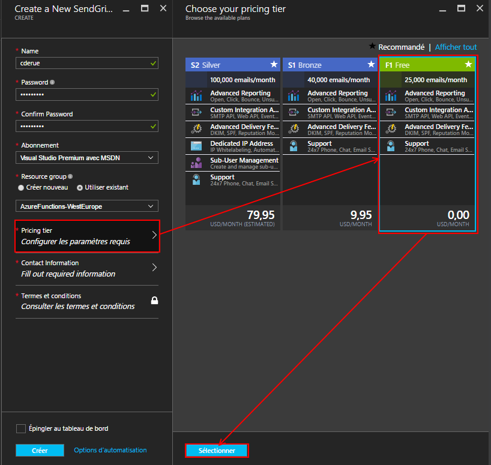

    - Cliquez sur __Contact Information__ et remplissez le formulaire de contact 
    
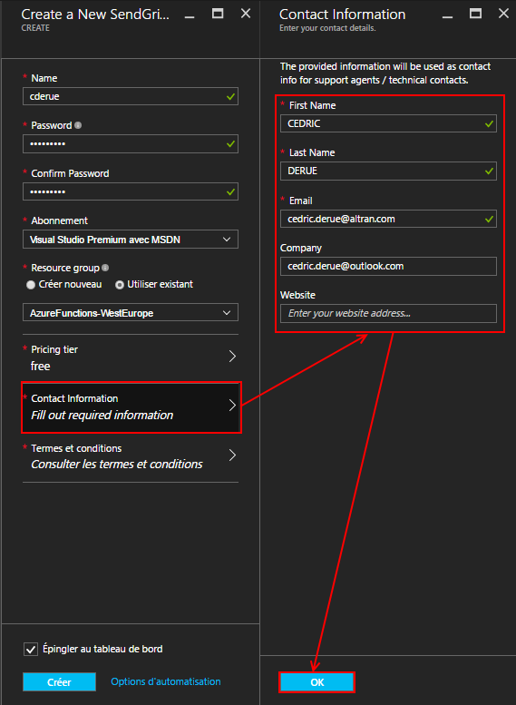

    - Cliquez sur __Termes et conditions__  et cliquez sur __Acheter__

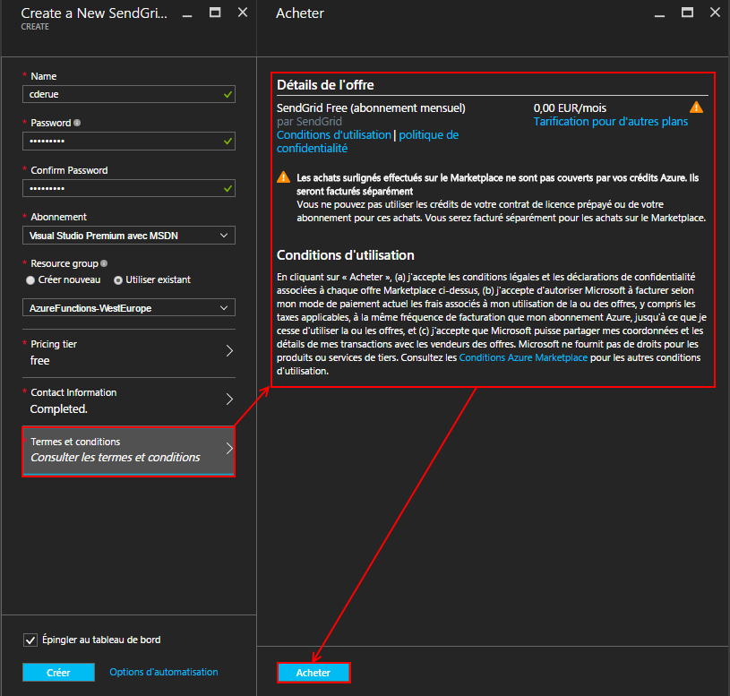

    - Cochez la case __Epingler au tableau de bord__
    - Cliquez sur __Créer__ pour lancer la création du compte SendGrid
    
*Après quelques instants, le compte SendGrid est prêt et les informations générales du compte s'affiche dans le portail Azure.*

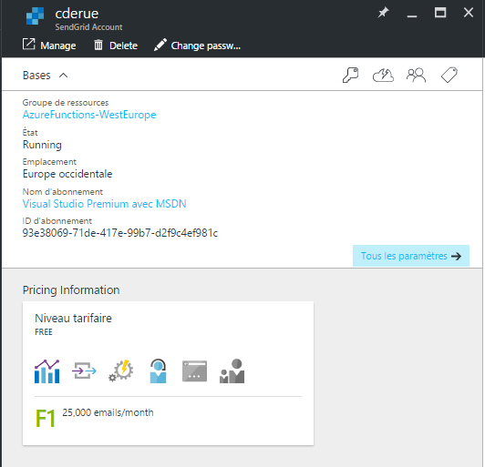

Nous allons maintenant nous connecter au portail SendGrid pour créer une clé d'API que nous utiliserons par la suite avec Azure Functions pour envoyer des emails.
- Cliquez sur __Manage__


*Le portail Azure nous redirige vers le portail SendGrid.*

- Dans le panneau gauche du portail SenGrid, cliquez sur __Settings > API Keys__
- En haut à droite du portail, cliquez sur __Create API Key__ puis sur __General API Key__

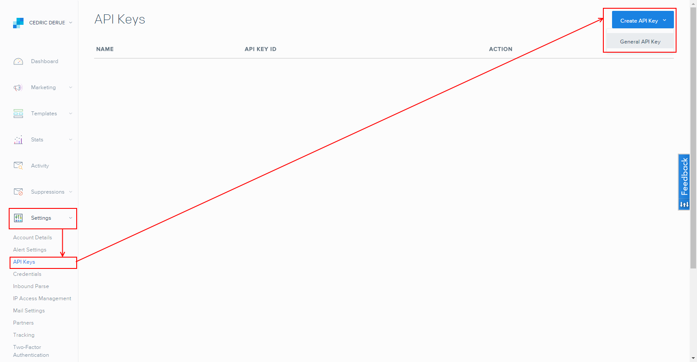

- Dans le formulaire de création d'une nouvelle API :
    - Saisissez un nom pour la nouvelle clé
    - Paramétrez les droits en sélectionnant __FULL ACCESS__ pour les sections __Mail Send__ et __Template Engine__
    - Cliquez sur __Save__ pour sauvegarder la nouvelle clé d'API
    


*SendGrid crée alors une nouvelle clé d'API et affiche la valeur de la clé.*

- Copiez la valeur de la clé d'API et collez-là dans un fichier texte

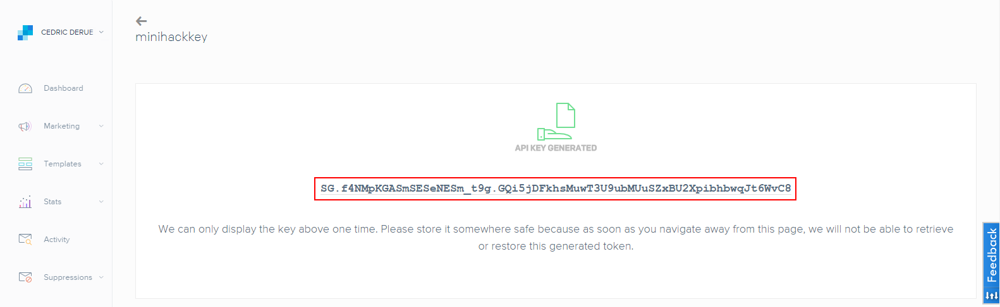

## 3) Créer un service d'envoi d'email avec Azure Functions

Pour initialiser un nouveau service avec Azure Functions :

- Connectez-vous à l'adresse au portail Azure
- Dans la zone de recherche __Rechercher dans le marketplace__, saisissez __Function App__
- Tapez sur la touche __Entrée__ de votre clavier pour lancer la recherche

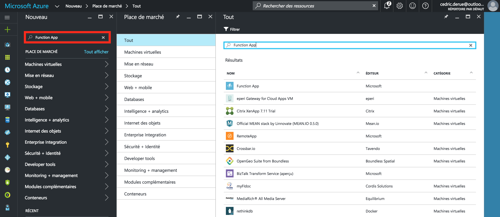

- Dans la liste des résultats, sélectionnez __Function App__
- Cliquez sur __Créer__ pour démarrer la création d'une nouvelle fonction Azure  

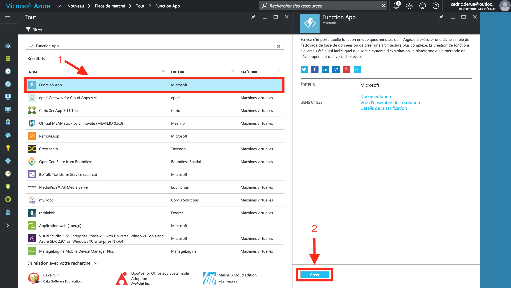

- Dans la zone de saisie __Nom de l'application__, indiquez le nom la nouvelle application de fonction
- Sélectionnez l'abonnement Azure (dans le cas où vous auriez plusieurs abonnements Azure)
- Sélectionnez l'option __Créer nouveau__ pour le groupe de ressources et saisissez un nom pour ce groupe de ressources (attention de ne pas choisir un nom déjà pris)
- Dans la zone de sélection __Plan App Service__, laissez la valeur __Dynamique__ sélectionnée par défaut
- Dans la zone de sélection __Emplacement__, choisissez la localisation __Europe occidentale__
- Dans la zone de sélection __Allocation de mémoire__, laissez la valeur __128__ sélectionnée par défaut
- Cochez la case __Epingler au tableau de bord__ : conseillé pour accéder plus facilement à votre application de fonction
- Cliquez sur le bouton __Créer__ pour lancer la création de l'application de fonction

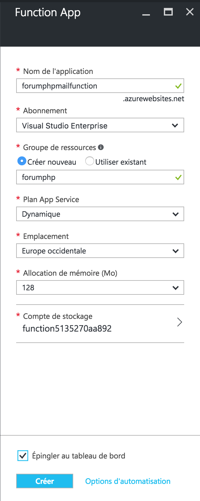

*Une page d'accueil à Azure Functions s'affiche.*

- Cliquez sur le lien __Vous pouvez aussi créer votre propre fonction personnalisée__

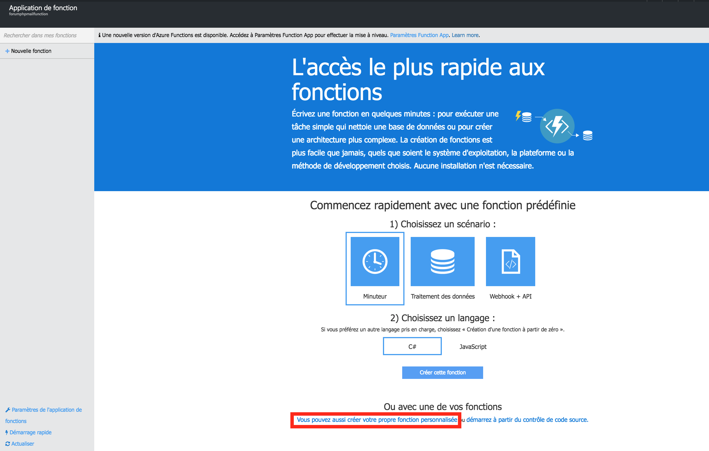

*Un assistant de création de la nouvelle fonction Azure s'affiche.*

- Sélectionnez __PHP__ pour le langage de la fonction
- Sélectionnez __Tout__ pour le scénario
- Sélectionnez le modèle __Empty-PHP__
- Nommez votre fonction (à vous de choisir)
- Cliquez sur __Créer__

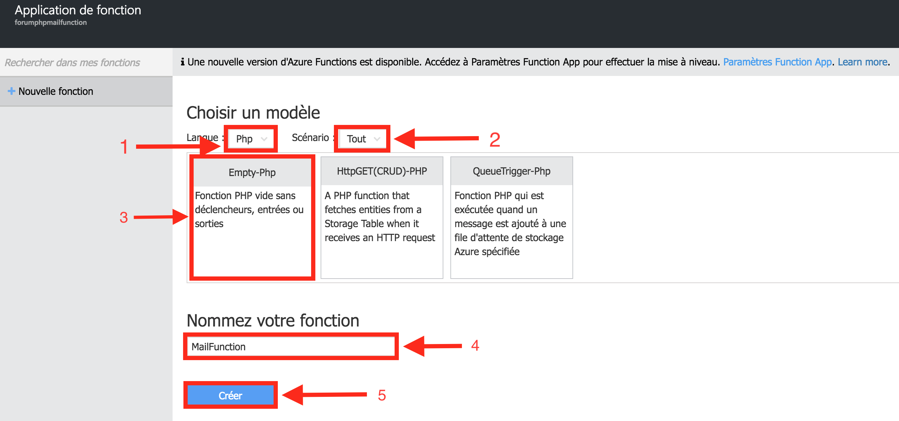

*Azure Functions génére une nouvelle fonction Azure vide qui attend du code PHP.*
*Un message d'erreur nous avertit qu'au moins un binding doit être déclaré.*
*Pas d'inquiétude, nous allons revenir là-dessus juste après.*

- Fermez la fenêtre d'erreur en cliquant sur la croix

L'écran de visualisation de la fonction comporte les zones suivantes :
- URL de la fonction : cette URL sera utilisée plus tard dans la création d'un web hook dans la console Kudu
- Code : implémentation du code de la fonction Azure
- Journaux : console d'affichage des traces d'exécution de la fonction lorsque que celle-ci est appelée
- Exécuter : interface de test de la fonction

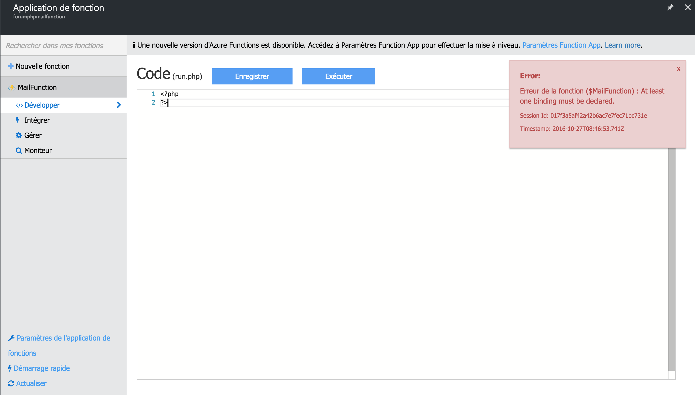

- Cliquez sur __Aficher les fichiers__ pour afficher la liste des fichiers qui composent la fonction Azure.

*2 fichiers apparaissent dans cette liste :* __run.php__ et  __function.php__

- Cliquez sur le fichier __function.php__ et remplacez le code du fichier avec le code suivant :

```json
{
  "bindings": [
    {
      "type": "httpTrigger",
      "name": "req",
      "webHookType": "genericJson",
      "direction": "in"
    },
    {
      "type": "sendGrid",
      "name": "message",
      "from": "noreply@platform.sh",
      "direction": "out",
      "to": "<Insert your email here>",
      "subject": "",
      "text": ""
    }
  ],
  "disabled": false
}
```
- A la ligne 14, remplacez l'expression du fichier "Insert your email here" par votre email  
- Cliquez sur __Enregistrer__ pour sauvegarder les modifications

- Puis cliquez sur le fichier __run.php__ et copiez le contenu du fichier __run.demo.php__ fourni dans le répertoire __Sources__ de ce mini-hack

```php
<?php
 
$platform_deployer_app_url =$_SERVER['DEPLOY_OR_NOT_URL'];
$api = 'https://api.sendgrid.com/v3/mail/send';
$request = null;
$url = null;
$project = null;
$payload = null;
$environment = null;
$machine_name = null;
$res = new stdClass();
$to = new stdClass();
$from = new stdClass();
$cont_element = new stdClass();
 
function autolink($str) {
$str = ' ' . $str;
$str = preg_replace(
     '`([^"=\'>])((http|https)://[^\s<]+[^\s<\.)])`i',
     '$1<a  href="$2">$2</a>',
     $str
);
$str = substr($str, 1);
 
 return $str;
}
if (!getenv('req')) {
  throw new \Exception("Invalid request");
}
 
$request = json_decode(file_get_contents(getenv('req')));
 
if (!property_exists($request, 'project')) {
  throw new \Exception("Invalid project");
}
 
if ($request->type!="environment.branch"){
  throw new \Exception("Only Supporting Branching for the moment");
}
 
$project = $request->project;
$environment = $request->parameters->environment;
$parent = $request->parameters->environment;
$log = autolink($request->log);
 
$deploy_or_not_url  = $platform_deployer_app_url ."?project=".$project . "&environment=".$environment;
$deploy_or_not_link = '<a style="display: inline-block; color: #ffffff; background-color: #3498db; border: solid 1px #3498db; border-radius: 5px; box-sizing: border-box; cursor: pointer; text-decoration: none; font-size: 14px; font-weight: bold; margin: 0; padding: 12px 25px; text-transform: capitalize; border-color: #3498db;" href="'. $deploy_or_not_url.'">'.$deploy_or_not_url."</a>";

$content = "Environment ".$environment." was just created and deployed from parent ". $parent. ".<br><br>\n\n";
$content .= "<pre>".$log."</pre>";
$content .= "You can click on the link above to review the changes.<br>";
$content .= "And if you really like them,  use DeployOrNot to deploy (or not). by visiting:<br>\n\n";
$content .= $deploy_or_not_link;
$template = file_get_contents("template.html");
$content = str_replace("{{content}}", $content ,$template);

$res->subject = "Deploying apps with Platform.sh and Azure Functions is amazing!";
$res->text=$res->subject;

$cont_element->type="text/html";
$cont_element->value=$content;
$res->content=[$cont_element];

$res =  json_encode($res);

file_put_contents($_SERVER['message'], $res);
```

- Cliquez sur __Enregistrer__ pour sauvegarder les modifications

- Cliquez sur __Add__ pour ajouter un nouveau fichier à la fonction Azure
- Nommez le nouveau fichier __template.html__
- Copiez-collez le contenu du fichier __template.demo.html__

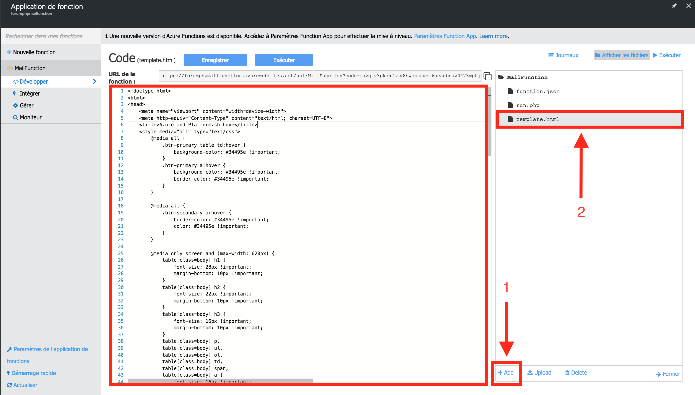

## 5) Créer les variables d'environnement de la fonction Azure

- Cliquez sur __Paramètres de l'application de fonctions__
- Puis, cliquez sur __Accéder aux paramètres App Service__

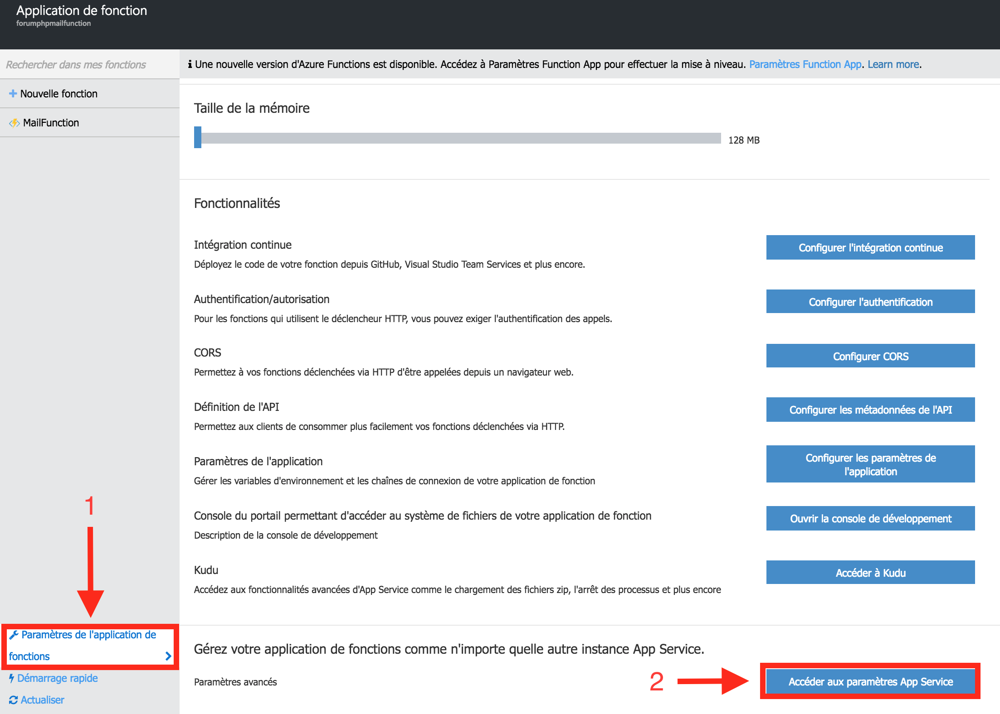

- Cliquez sur __Paramètres de l'application__
- Ajoutez deux nouveaux paramètres d'application nommés __AzureWebJobsSendGridApiKey__ et __DEPLOY_OR__NOT__URL__ avec pour valeur respective votre clé d'API SendGrid et l'URL de votre projet Platform

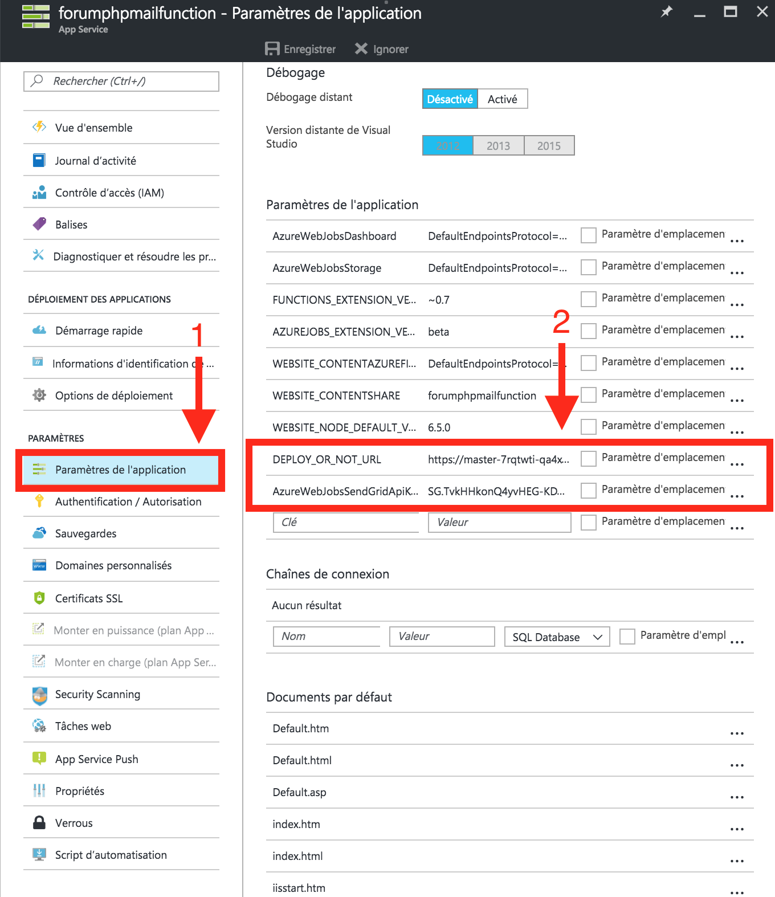

## 5) Créer un web hook dans le projet Platform.sh

Pour appeler notre fonction Azure après chaque création de branche dans notre projet Platform.sh, il est nécessaire de créer un Web Hook.
Pour ce faire, exécutez la commande suivante depuis un terminal :

```bash
platform integration:add --type=webhook --project=<nom_du_projet> --url=<url_de_la_fonction_Azure>
```

*La CLI est en mode interactif et pose plusieurs questions sur le nouveau web hook à créer*

- Répondez à ces questions en laissant à chaque fois la réponse proposée par défault par la CLI Platform.sh

*Une nouvelle URL apparaît maintenant dans la liste des web hooks.*


## 6) Créer une nouvelle branche dans le projet Platform.sh

Testons maintenant si notre fonction Azure d'envoi d'emails fonctionne correctement :
- Créer une nouvelle branche dans le projet Platform.sh

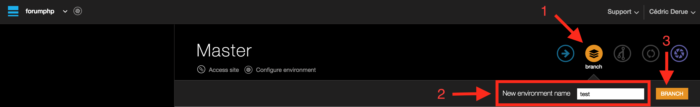

*La création de cette nouvelle branche va déclencher le web hook précédemment ajouté au projet et l'appel à la fonction Azure se produire.*

- Patientez quelques instants et vérifiez la bonne réception de l'email.

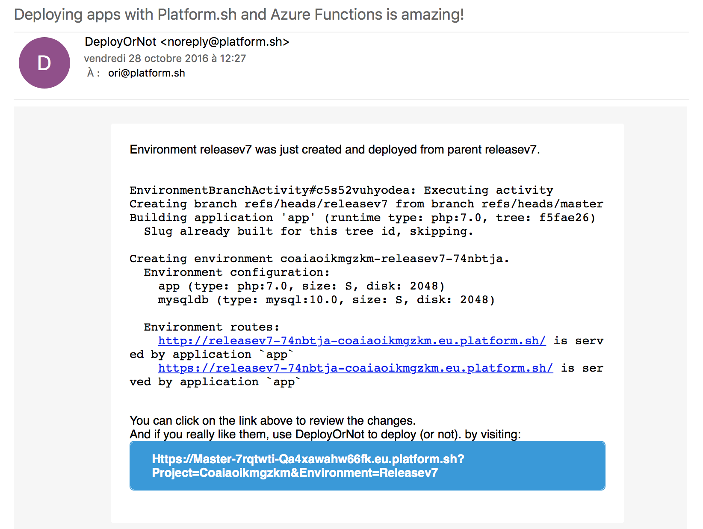