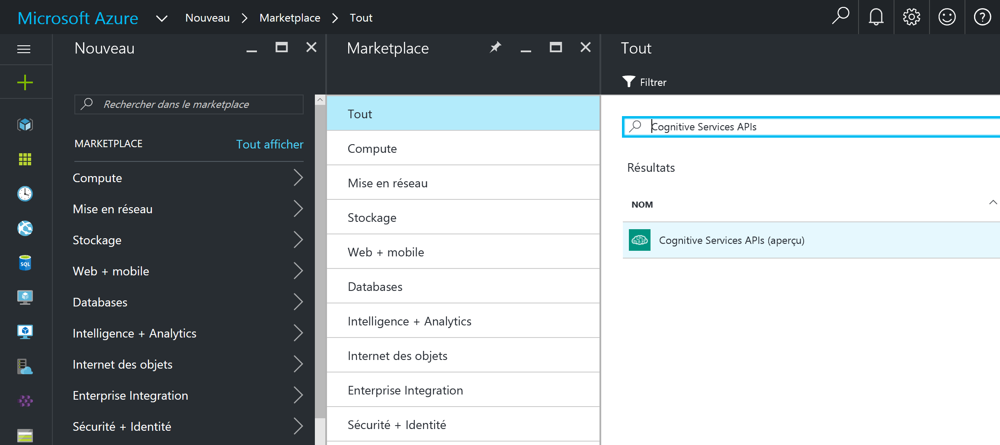
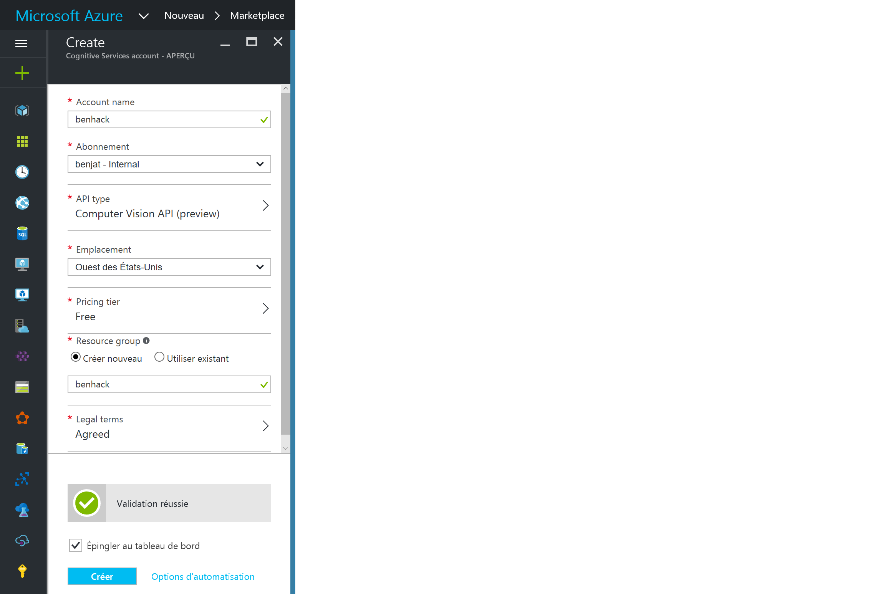
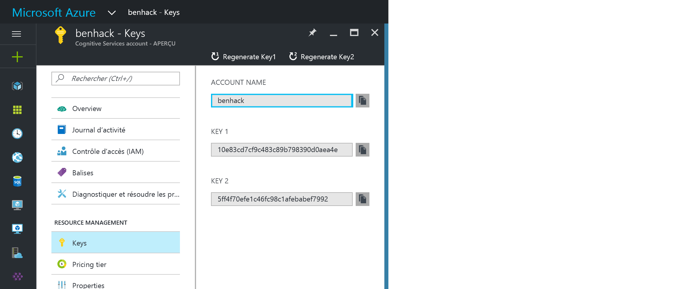
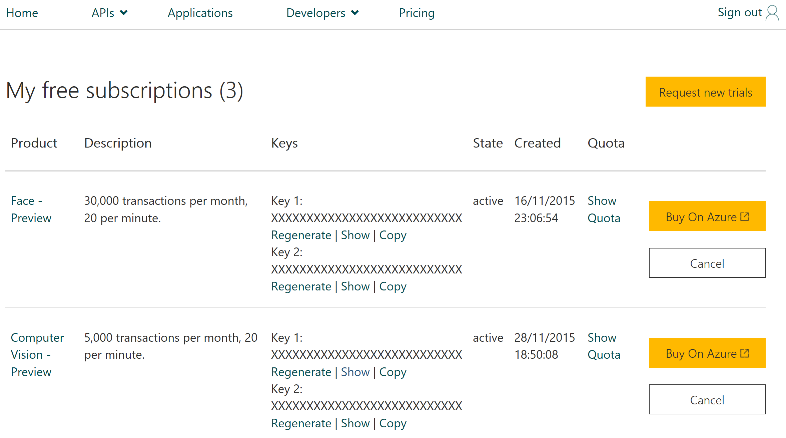
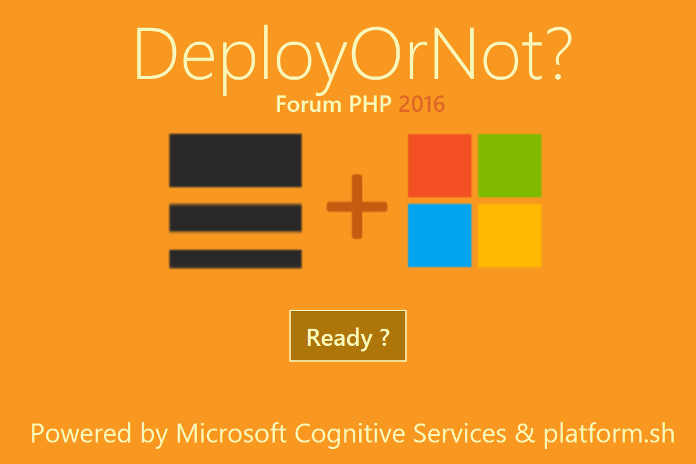

# Microsoft Cognitive Services
Pour ce mini-hack, je vous propose d'utiliser Microsoft Cognitive Services, et plus précisément l'API Computer Vision pour détecter l'humeur d'un visage.

## 1) Prérequis
- L'un des éditeurs de code avancé suivant : 
    - [Visual Studio Code](https://code.visualstudio.com)
    - [Atom](https://atom.io/)
    - [Sublime Text](https://www.sublimetext.com/)
- Un compte Microsoft Azure :
    - [Microsoft Azure](https://azure.microsoft.com/fr-fr/free/)
- Un compte Platform.sh :
    - [Platform.sh](https://accounts.platform.sh/checkout/314648)
- La CLI Platform.sh :
    - [Platform.sh CLI](https://docs.platform.sh/overview/cli.html)
- Git :
    - [Git pour Windows](https://git-scm.com/download/win)
    - [Git pour Mac OS X ou Linux](https://git-scm.com/book/fr/v1/D%C3%A9marrage-rapide-Installation-de-Git)
- Une distribution récente de PHP 5 ou 7 avec l'extension openssl activée :
    - [PHP 5.6](https://secure.php.net/downloads.php#v5.6.26) 
    - [PHP 7.0](https://secure.php.net/downloads.php#v7.0.11)

## Récupération d'une clé d'API

Vous avez la possibilité de récupérer une clé d'API via votre compte Azure ou via le site Microsoft Cognitive Services, qui vous permet de générer des clés d'évaluation.

### A partir d'Azure

Sur le [portail Azure](https://portal.azure.com), créez un nouveau service Computer Vision en recherchant "Cognitive Services APIs" dans le moteur de recherche :



Complétez ensuite les différents paramètres nécessaires :
- Nom du compte : à vous de choisir
- Abonnement (dans le cas où vous auriez plusieurs abonnements Azure)
- Type d'API : Computer Vision API
- Niveau de tarification : le niveau gratuit sera suffisant
- Emplacement : Ouest des Etats-Unis (le seul choix à ce jour)
- Groupe de ressources : un nouveau groupe de ressource pour le mini-hack sera parfait
- Termes légaux : à lire et à valider
- Epingler au tableau de bord : conseillé pour accéder plus facilement à votre service



Quelques secondes plus tard, votre service sera créé et vous pourrez y accéder pour notamment récupérer une clé d'API, que vous aurez besoin dans quelques minutes.



### A partir du portail Cognitive Services

En vous rendant sur le [portail Cognitive Services](https://www.microsoft.com/cognitive-services/en-us/subscriptions), vous avez la possibilité de demander des clés d'APIs, utilisables pour de l'évaluation seulement (pas de production).
Le processus est assez simple :
- Connectez-vous avec un compte Microsoft (ex Live-Id)
- Cliquez sur "Request new trials"
- Sélectionnez les APIs qui vous intéressent (Computer Vision dans notre cas)
- Validez les conditions d'utilisation
- Cliquez sur le bouton d'abonnements

Vous aurez ensuite accès à votre clé d'API.



## Création d'une application PHP avec Platform.sh

Maintenant que vous avez accès à une clé d'API Computer Vision, il est temps d'utiliser ce service. 
Pour ce faire nous allons créer une application PHP utilisant la clé d'API Computer Vision.
L'application PHP proposée pour ce mini-hack consiste à détecter l'humeur d'un visage en utilisant une webcam et l'API Computer Vision.
En fonction de votre humeur, bonne ou mauvaise, l'application PHP est capable ou non de mettre en production n'importe quelle application géree dans Platform.sh. 
Ainsi, si vous êtes de bonne humeur, alors le déploiement pourra avoir avoir lieu. Dans le cas contraire, pas de déploiement !

C'est parti, à vous de jouer :

- Pour gagner du temps, clonez le dépôt Git suivant :

```bash
git clone https://github.com/OriPekelman/DeployOrNot/
```
*Les sources récupérées par clonage correspondent à un projet Platform.sh.*

- Depuis un terminal, placez vous à l'intérieur du dépôt Git cloné et exécutez les commandes suivantes :
```bash
# Install composer dependencies
composer install
# Set the value for the Computer Vision API key with Platform CLI
platform variable:set env:EMOTION_API_KEY <valeur_de_la_clé_API_Computer_Vision>
```

- Créez maintenant, un projet d'application PHP vide sous Platform.sh
- Récupérez l'URL Git du projet
- Exécutez la commande suivante depuis un terminal :

```bash
git remote add platform <url_git_du_projet_platformsh>
```

## Déploiement de l'application PHP sur Platform.sh
La première chose que doit faire l'application est de récupérer une capture du visage de l'utilisateur grâce à l'API HTML5 
Cette capture est enregistrée côté serveur dans un fichier temporaire. Ce fichier est ensuite envoyé à l'API Computer Vision.
Les APIs Cognitive Services sont des APIs REST, accessibles via des requêtes HTTP simples et donc depuis n'importe quelle plateforme et langage pouvant envoyer des requêtes HTTP.  
Ici, cela se passe via un appel de l'objet Http_Request2 vers l'API REST Computer Vision comme le montre le ficher api.php présent dans les sources de l'application :

```php
<?php
$request = new Http_Request2('https://api.projectoxford.ai/emotion/v1.0/recognize');
$url = $request->getUrl();

$headers = array(
    // Request headers
    'Content-Type' => 'application/octet-stream',
    'Ocp-Apim-Subscription-Key' => $key,
);

$request->setHeader($headers);

$parameters = array(
    // Request parameters
);

$url->setQueryVariables($parameters);

$request->setMethod(HTTP_Request2::METHOD_POST);
$content = file_get_contents($filename);

$request->setBody($content);
$response = $request->send();
?>
```

La réponse renvoyée par l'API Computer Vision est ensuite analysée pour décider 
si le déploiement du projet Platform.sh passé en paramètre aura lieu comme le montre l'extrait de code suivant :

```php
<?php
$environment = preg_replace("/[^A-Za-z0-9 ]/", '', $_GET["environment"]);
$project = preg_replace("/[^A-Za-z0-9 ]/", '', $_GET["project"]);
if ($environment && $project){
$command = "platform environment:merge -y -p ". $project . " ".$environment ;
$process = new Process($command);
$process->run(function ($type, $buffer) {
    if (Process::ERR === $type) {
        echo '<span class="error">'.$buffer.'</span>';
    } else {
        echo  $buffer;
    }
});

} else
{
echo "Vous devez spécifier un projet et un environnment à déployer";
}
?>
```

- Pour déployer l'application sur Platform.sh, exécutez la commande suivante depuis un terminal :
```bash
git push platform master
```
*Le déploiement de l'application prend quelques secondes.*

Il ne reste plus qu'à tester votre application, qui devrait vous afficher une page comme le montre la figure suivante :



- Cliquez sur __Ready__ pour lancer la webcam
- 

Si vous n'avez pas d'inspiration, voici quelques photos que vous pouvez utiliser :
- https://upload.wikimedia.org/wikipedia/commons/thumb/f/f0/Stiftskirche_Herzogenburg_Orgel_06.JPG/800px-Stiftskirche_Herzogenburg_Orgel_06.JPG
- https://upload.wikimedia.org/wikipedia/commons/thumb/d/dc/Sigmaringen_Schloss_BW_2015-04-28_17-37-14.jpg/800px-Sigmaringen_Schloss_BW_2015-04-28_17-37-14.jpg
- https://upload.wikimedia.org/wikipedia/commons/thumb/c/cc/Parapente_-_166.jpg/800px-Parapente_-_166.jpg
- https://upload.wikimedia.org/wikipedia/commons/thumb/b/b3/Cat_on_a_macbook.JPG/1920px-Cat_on_a_macbook.JPG

## Pour aller plus loin

Ces parties sont optionnelles dans le cadre du mini-hack, mais voici quelques idées pour aller plus loin :

- Utiliser l'API [Microsoft Translator](https://www.microsoft.com/en-us/translator/default.aspx) pour traduire le résultat en français.